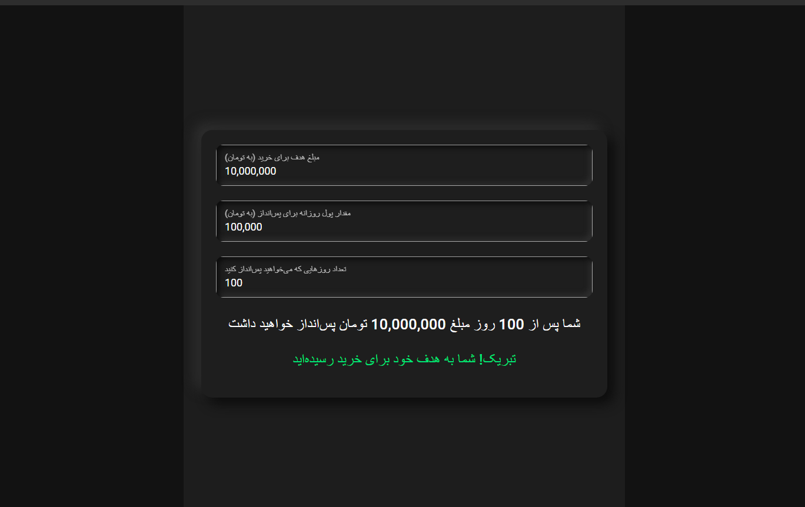

# Quasar App (save-my-money)

A Quasar Project

## Install the dependencies

```bash
yarn
# or
npm install
```

### Start the app in development mode (hot-code reloading, error reporting, etc.)

```bash
quasar dev
```

### Build the app for production

```bash
quasar build
```

### Customize the configuration

See [Configuring quasar.config.js](https://v2.quasar.dev/quasar-cli-vite/quasar-config-js).

# محاسبه و هدف گذاری برای پس‌انداز

این پروژه یک برنامه ساده برای محاسبه و هدف‌گذاری پس‌انداز است که با استفاده از فریم‌ورک Quasar و Vue.js ساخته شده است. این برنامه به کاربران این امکان را می‌دهد که مقدار پولی که روزانه قصد پس‌انداز دارند و تعداد روزهایی که می‌خواهند پس‌انداز کنند را وارد کنند. سپس، برنامه مجموع پس‌انداز را محاسبه کرده و آن را با هدف تعیین‌شده توسط کاربر (مثل خرید ماشین) مقایسه می‌کند.



### ویژگی‌ها

- **ورودی پس‌انداز روزانه**: امکان وارد کردن مبلغ پس‌انداز روزانه.
- **ورودی تعداد روزها**: امکان وارد کردن تعداد روزهایی که قصد پس‌انداز دارید.
- **هدف‌گذاری پس‌انداز**: تعیین هدف پس‌انداز (مانند خرید ماشین).
- **محاسبه خودکار**: محاسبه مجموع پس‌انداز و مقدار باقی‌مانده برای رسیدن به هدف به صورت لحظه‌ای.
- **طراحی نئومورفیسم**: استفاده از طراحی نئومورفیسم برای رابط کاربری مدرن و جذاب.
